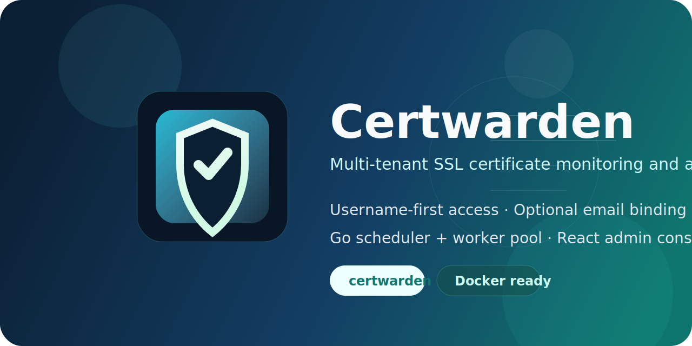
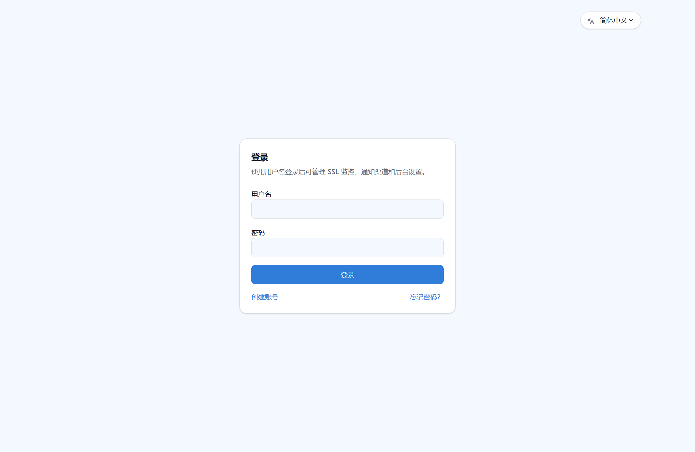
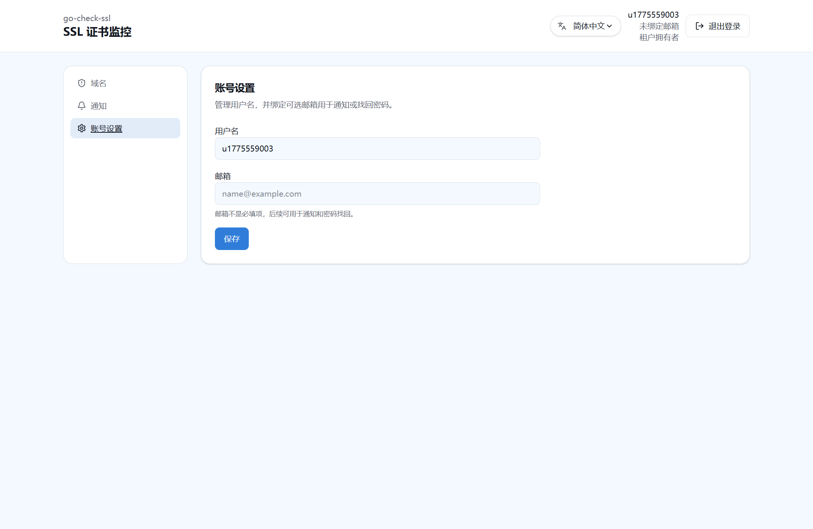
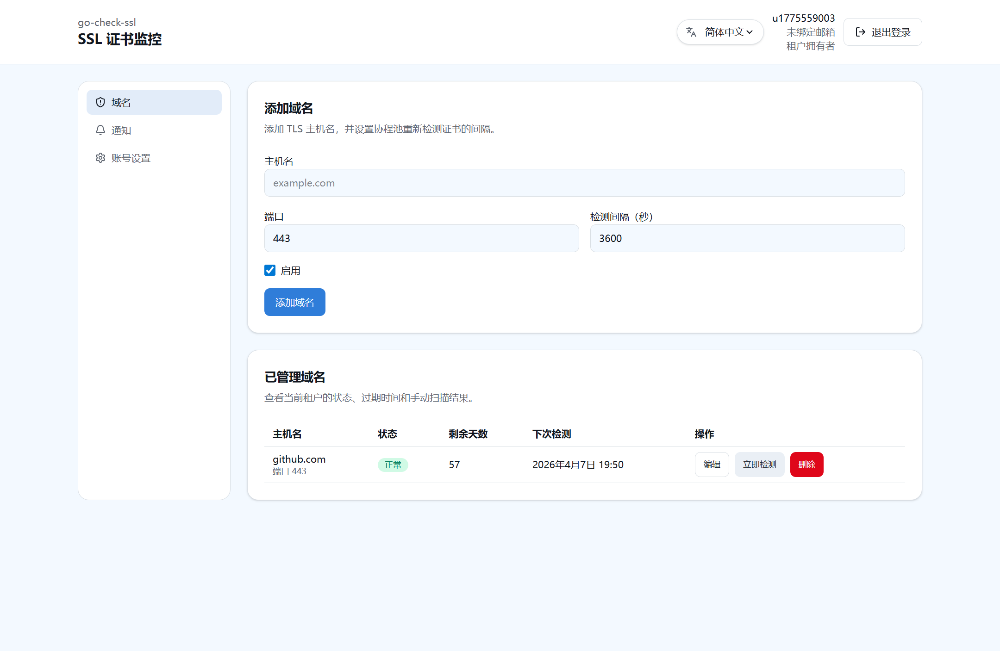
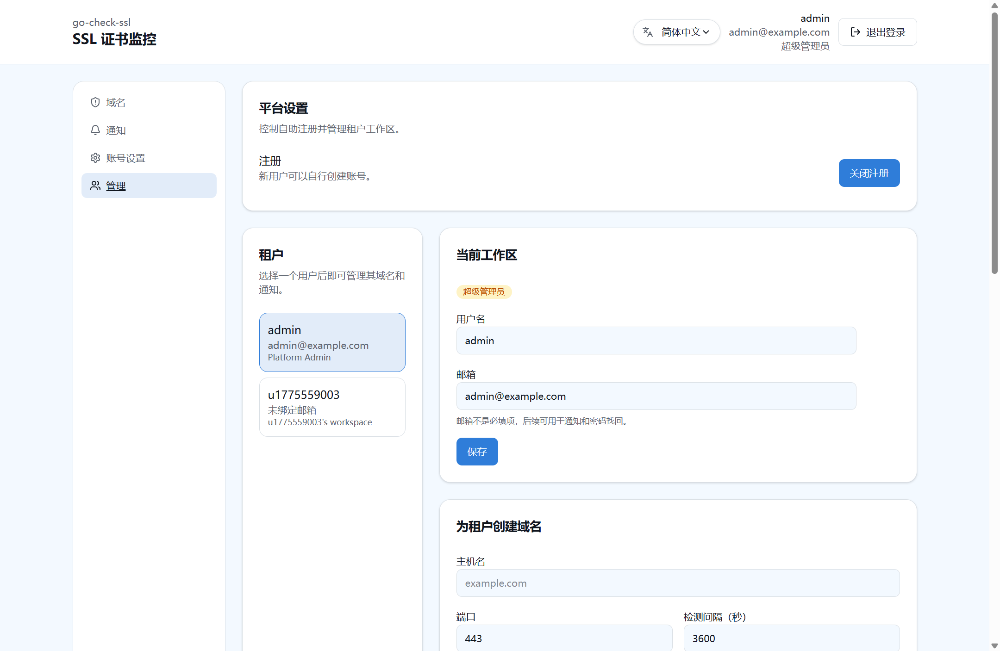
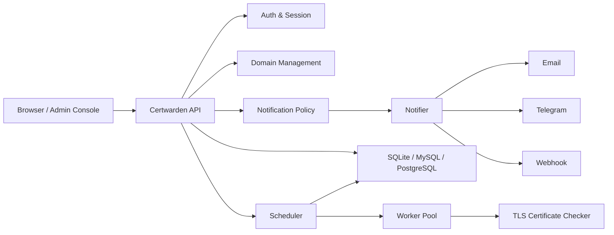
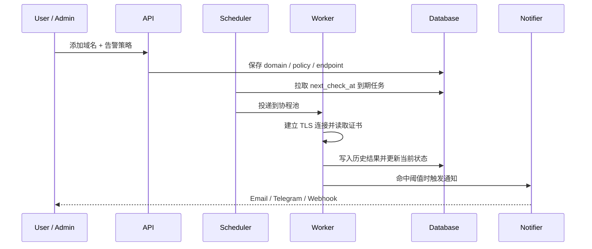

# Certwarden

<p align="center">
  
</p>

<p align="center">
  一个面向团队与托管平台的多租户 SSL 证书监控与告警系统。
</p>

<p align="center">
  用户名优先登录 · 可选邮箱绑定 · Email / Telegram / Webhook · Go 协程池检测 · React 管理台
</p>

> 推荐的新 GitHub 仓库名：`certwarden`
>
> 这个名字比 `go-check-ssl` 更像正式产品：`Cert` 直接点明证书场景，`warden` 表达持续守护、预警和值守的产品定位。

## 为什么叫 Certwarden

- **直接**：看到名字就知道它是做证书监控和守护的。
- **有产品感**：适合作为 OSS 项目名、Docker 镜像名、1Panel 应用名和后台系统名。
- **好扩展**：后续如果加入证书链诊断、端口拨测、资产看板、SLA 报表，名字也不会显得局促。

如果你想保留一点原始风格，我建议把仓库名改成以下其一：

1. `certwarden`（首选，最像正式产品）
2. `certwarden-oss`（适合以后做官网或商业版区分）
3. `certwarden-platform`（如果你更强调多租户平台定位）

## 它解决什么问题

Certwarden 用来持续检测 HTTPS / TLS 证书的过期时间、健康状态和告警阈值，让你不再靠临时脚本或日历提醒管理证书资产。

它适合这些场景：

- 运维团队统一管理多个业务域名
- SaaS 平台为不同租户托管域名与通知策略
- 小团队用单 Docker Compose 快速上线一个可视化证书监控台
- 1Panel 用户希望直接导入 Compose 即部署

## 界面预览

| 登录与多语言 | 账号设置 |
| --- | --- |
|  |  |

| 用户域名总览 |
| --- |
|  |

| 管理后台 |
| --- |
|  |

## 核心能力

| 模块 | 能力 |
| --- | --- |
| 认证 | 用户名注册、用户名登录、可选邮箱绑定、忘记密码 / 重置密码 |
| 监控 | 手动检测 + 定时扫描，按 `next_check_at` 调度域名任务 |
| 告警 | Email、Telegram、Generic Webhook |
| 策略 | 租户默认阈值 + 域名级覆盖，例如 `30 / 7 / 1` 天 |
| 管理 | 管理员可控制注册开关，并代管用户资料、域名和通知 |
| 多租户 | 单库共享表 + `tenant_id` 数据隔离 |
| 数据库 | SQLite / MySQL / PostgreSQL |
| 部署 | 单 `docker-compose.yml`、默认 SQLite、适配 1Panel Compose 导入 |
| 前端 | React + Vite + Tailwind，支持简中 / 繁中 / 英文 / 法文 / 俄文 / 日文 / 西班牙语 |

## 系统架构



## 检测与告警流程



## 当前产品定位

这一版的定位非常清晰：

- **账号即租户**
- **用户名是主账号标识**
- **邮箱是可选绑定资料**
- **邮箱可用于通知和密码找回，但注册时不强制填写**

这意味着新用户注册只需要：

1. 用户名
2. 密码

后续可以在“账号设置”里绑定邮箱，也可以由管理员在后台代为维护。

## 快速开始

### 1. 本地开发

```bash
cp .env.example .env
```

启动后端：

```bash
cd apps/api
go run ./cmd/server
```

启动前端：

```bash
cd apps/web
npm install
npm run dev
```

### 2. 验证命令

```bash
make api-test
make web-test
make lint
make build
```

### 3. Docker Compose

默认使用 SQLite：

```bash
docker compose up --build -d
```

默认对外端口：

- `8080`：Web UI + API

## 关键环境变量

| 变量 | 说明 | 默认值 |
| --- | --- | --- |
| `APP_ADDR` | HTTP 监听地址 | `:8080` |
| `APP_BASE_URL` | 对外访问地址 | `http://localhost:8080` |
| `DB_DRIVER` | 数据库驱动 | `sqlite` |
| `DATABASE_URL` | 数据库连接串 / 文件路径 | `data/go-check-ssl.db` |
| `ALLOW_REGISTRATION` | 是否允许公开注册 | `true` |
| `BOOTSTRAP_ADMIN_USERNAME` | 初始管理员用户名 | `admin` |
| `BOOTSTRAP_ADMIN_EMAIL` | 初始管理员联系邮箱，可留空 | 空 |
| `BOOTSTRAP_ADMIN_PASSWORD` | 初始管理员密码 | `ChangeMe123!` |
| `SCAN_CONCURRENCY` | 检测协程池大小 | `5` |
| `SCAN_INTERVAL` | 默认检测周期 | `1h` |
| `SMTP_*` | SMTP 配置 | 空 |
| `TELEGRAM_BOT_TOKEN` | Telegram Bot Token | 空 |
| `WEBHOOK_TIMEOUT` | Webhook 超时 | `5s` |

## 部署方式

### 1Panel

第一版部署方式就是 **Compose 导入**：

1. 在 1Panel 中新建编排
2. 导入仓库根目录的 `docker-compose.yml`
3. 根据你的环境填写 `.env`
4. 启动服务

### 单机 Docker

```bash
cp .env.example .env
docker compose up -d --build
```

### 切换数据库

默认是 SQLite。如果你想改成 MySQL 或 PostgreSQL，只需要改：

- `DB_DRIVER`
- `DATABASE_URL`

应用层已经按三种数据库的公共能力设计，不依赖特定方言特性。

## 仓库结构

```text
.
├─ apps/
│  ├─ api/     # Go API + scheduler + worker pool
│  └─ web/     # React + Vite + Tailwind + 管理台
├─ deploy/     # 部署说明
├─ docs/
│  ├─ branding/
│  └─ screenshots/
├─ .github/workflows/
├─ docker-compose.yml
└─ Dockerfile
```

## 技术栈

- **Backend**: Go, chi, GORM, gormigrate
- **Frontend**: React, Vite, Tailwind CSS, React Router, TanStack Query, React Hook Form, Zod
- **Database**: SQLite / MySQL / PostgreSQL
- **Delivery**: Docker Compose, GitHub Actions, GHCR

## 当前已经完成的产品特性

- 用户名注册与用户名登录
- 可选邮箱绑定
- 密码找回
- 域名管理与历史记录
- 手动检测与调度扫描
- 告警渠道与阈值策略
- 管理后台代管租户资源
- 多语言界面

## 后续路线图

- 更完整的通知模板与多语言邮件
- 更细粒度的租户成员和权限模型
- 批量导入域名
- 证书链 / SAN / 颁发机构 / 指纹等更详细诊断
- Dashboard 图表与可视化报表
- 更完整的 1Panel 应用模板封装

## SQLite 说明

当前默认数据库为 SQLite。

如果你在本地直接运行 Go 测试或构建，并且本机没有可用的 CGO / C toolchain，SQLite 相关测试可能会受影响；Docker 构建镜像已经补齐编译环境，所以容器部署不受这个问题影响。
